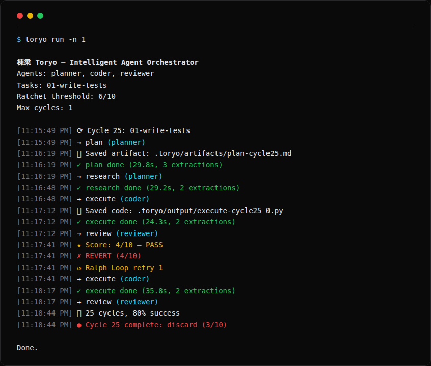
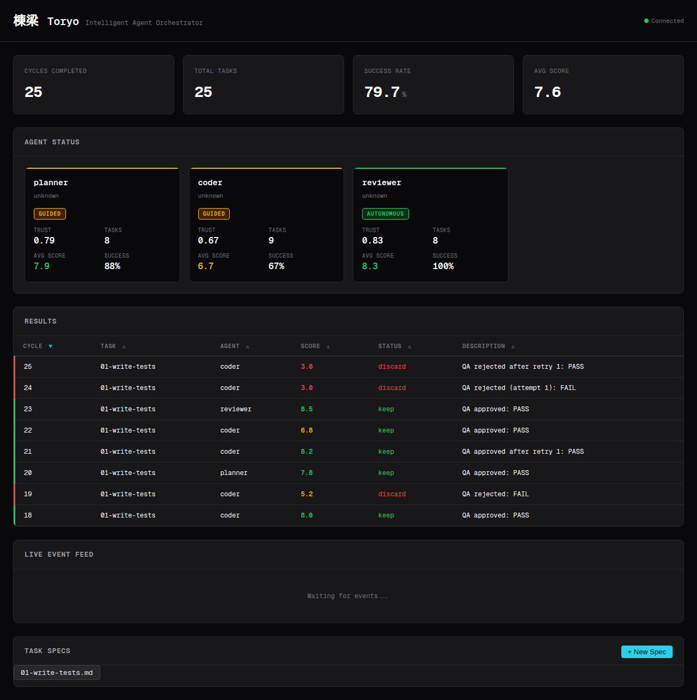

# 棟梁 Toryo

[](https://github.com/JesseRWeigel/toryo/actions/workflows/ci.yml)
[](https://www.npmjs.com/package/toryo-core)
[](LICENSE)
[](https://www.typescriptlang.org/)

**The intelligent agent orchestrator.** Not just parallel agents — the full self-improving development loop.

> **棟梁 (toryo)** — Japanese for "master builder" or "foreman." The toryo is the person who oversees the entire construction crew, assigns specialists to the right tasks, and ensures every piece meets quality standards before it stays in the structure.

Toryo chains multiple AI coding agents (Claude Code, Aider, Gemini CLI, Codex, Ollama) with spec-driven workflows, trust-based delegation, quality ratcheting, and a real-time dashboard.

```bash
npx @jweigel/toryo init    # scaffold config + task specs
npx @jweigel/toryo run     # start orchestration
```

**Try instantly:** `npx @jweigel/toryo demo` (no AI tools needed)

**[Documentation](docs/)** | **[Getting Started](docs/getting-started.md)** | **[Configuration](docs/configuration.md)** | **[Contributing](CONTRIBUTING.md)**



---

## Why Toryo?

Running AI agents in parallel is easy. Making them **work together intelligently** is hard.

| Problem | How Toryo solves it |
|---------|-------------------|
| Agents produce low-quality output | **Quality ratcheting** — only git-commit results that pass QA (score ≥ threshold). Auto-revert everything else. |
| No way to retry failures | **Ralph Loop** — failed attempts get QA feedback routed back to the agent for a retry before discarding. |
| Which agent should do what? | **Trust-based delegation** — agents earn autonomy through consistent scores. New agents start supervised. |
| Context gets lost between steps | **Smart truncation** — strips boilerplate, preserves substance, feeds optimal context to each phase. |
| Agent output disappears | **Auto-extraction** — code blocks and skills are automatically saved to disk as the agent produces them. |
| No visibility into what's happening | **Real-time dashboard** — live event feed, agent status cards, results table, metrics. |
| One agent isn't enough | **Pluggable adapters** — mix and match Claude Code, Aider, Gemini CLI, Ollama, or any CLI tool. |

## How It Works

Toryo runs **cycles**. Each cycle has 4 phases:

```
📋 Plan → 🔍 Research → ⚡ Execute → ✅ Review
```

1. **Plan** — An agent reads the task spec and creates a brief
2. **Research** — An agent gathers context and information
3. **Execute** — An agent writes code, tests, or documentation
4. **Review** — An agent scores the output (1-10) and provides feedback

After review:
- **Score ≥ threshold** → `git commit` (keep)
- **Score < threshold** → `git revert` → Ralph Loop retry → keep or discard
- **Infrastructure failure** → log as crash, skip scoring

This is the **ratcheting pattern** from [Karpathy's autoresearch](https://github.com/karpathy/autoresearch): only forward progress gets committed. Bad results are automatically reverted.

## Quick Start

### 1. Initialize

```bash
npx @jweigel/toryo init
```

Creates:
- `toryo.config.json` — agent definitions, quality gates, delegation rules
- `specs/` — task specifications (YAML frontmatter + markdown)

### 2. Configure Agents

Edit `toryo.config.json`:

```json
{
  "agents": {
    "researcher": {
      "adapter": "claude-code",
      "strengths": ["research", "analysis"],
      "timeout": 900
    },
    "coder": {
      "adapter": "ollama",
      "model": "qwen3.5:27b",
      "strengths": ["code", "architecture"],
      "timeout": 900
    },
    "reviewer": {
      "adapter": "claude-code",
      "strengths": ["review", "scoring"],
      "timeout": 600
    }
  }
}
```

### 3. Write Task Specs

Create markdown files in `specs/`:

```markdown
---
name: Write Unit Tests
difficulty: 0.5
tags: [testing]
phases:
  plan: auto
  research: auto
  execute: coder
  review: reviewer
---

Write tests for uncovered modules. Focus on edge cases.

## Acceptance Criteria
- [ ] Tests cover at least one untested module
- [ ] All tests pass
- [ ] Edge cases are covered
```

### 4. Run

```bash
npx @jweigel/toryo run              # run indefinitely
npx @jweigel/toryo run -n 10        # run 10 cycles
npx @jweigel/toryo run --dry-run    # preview without executing
toryo check                # validate config + tools
toryo status               # check metrics + agent trust
toryo dashboard            # open web dashboard
```

## Adapters

Toryo ships with first-class adapters for 5 tools + a generic adapter for anything else:

| Adapter | Tool | How it works |
|---------|------|-------------|
| `claude-code` | [Claude Code](https://claude.ai/code) | `claude --print` (non-interactive) |
| `aider` | [Aider](https://aider.chat) | `aider --message` |
| `gemini-cli` | [Gemini CLI](https://github.com/google-gemini/gemini-cli) | `gemini --prompt` |
| `ollama` | [Ollama](https://ollama.ai) | Direct HTTP API (no CLI needed) |
| `codex` | [Codex CLI](https://github.com/openai/codex) | `codex --prompt` |
| `custom` | Any CLI tool | Configurable command + args |

Mix and match — use Claude Code for research, Ollama for local code generation, and Gemini for review:

```json
{
  "agents": {
    "researcher": { "adapter": "claude-code" },
    "coder": { "adapter": "ollama", "model": "qwen3.5:27b" },
    "reviewer": { "adapter": "gemini-cli" }
  }
}
```

## Trust-Based Delegation

Agents start at **supervised** autonomy and earn trust through consistent high scores:

| Level | Trust | Behavior |
|-------|-------|----------|
| 🔴 Supervised | < 0.6 | Strict instruction following, precise format |
| 🟡 Guided | 0.6–0.8 | Follow spec but suggest improvements |
| 🟢 Autonomous | ≥ 0.8 | Take initiative, be creative, report after |

Trust is calculated from rolling average scores. An agent that consistently scores 8+/10 earns autonomous mode. An agent that drops below threshold gets demoted back to supervised.

```
Trust = min(avg_score / 10, 1.0)
```

When a task comes in, Toryo matches it to the best agent based on the task's profile (research-heavy? code-heavy? review?) and each agent's strengths + current trust level.

## Quality Ratcheting

Inspired by [Karpathy's autoresearch](https://github.com/karpathy/autoresearch) pattern:

```
Score ≥ 6.0 → git commit ✓
Score < 6.0 → git revert → Ralph Loop retry
                              ↓
                      Retry passes → git commit ✓
                      Retry fails  → discard, move on
```

Every result is logged to `results.tsv` (Karpathy format):

```
timestamp               cycle  task         agent   score  status   description
2026-03-19T10:15:00Z    42     write-tests  coder   8.2    keep     QA approved: PASS
2026-03-19T10:45:00Z    43     refactor     coder   4.1    discard  QA rejected: FAIL
2026-03-19T11:15:00Z    44     security     coder   7.5    keep     QA approved after retry 1: PASS
```

Configure thresholds in `toryo.config.json`:

```json
{
  "ratchet": {
    "threshold": 6.0,
    "maxRetries": 1,
    "gitStrategy": "commit-revert"
  }
}
```

## Dashboard

Real-time web dashboard showing agent status, results, and live events:

```bash
npx toryo dashboard
# Opens http://localhost:3456
```



Features:
- Agent status cards with trust scores and autonomy levels
- Results table with sortable columns and color-coded status
- Live event feed via WebSocket
- Metrics summary (cycles, success rate, avg scores)

## Notifications

Get notified on breakthroughs, failures, and periodic status:

```json
{
  "notifications": {
    "provider": "ntfy",
    "target": "my-project-toryo",
    "events": ["breakthrough", "failure", "status"]
  }
}
```

Supported providers: `ntfy`, `slack`, `discord`, `webhook`

## Architecture

Toryo is a composable TypeScript monorepo. Use the full orchestrator or individual pieces:

```
@toryo/core         — Engine: orchestrator, delegation, ratchet, metrics, extraction
@toryo/adapters     — Agent adapters: claude-code, aider, gemini-cli, ollama, custom
toryo               — CLI: init, run, status, dashboard
```

Each subsystem is a standalone factory function:

```typescript
import { createDelegation, createRatchet, createMetrics } from '@toryo/core';

// Use just the delegation system
const delegation = createDelegation({ initialTrust: 0.5 });
const level = delegation.getAutonomyLevel(agentState);

// Use just the ratchet for git-based quality gates
const ratchet = createRatchet({ threshold: 7.0 }, process.cwd());
if (!ratchet.shouldKeep(review)) await ratchet.revert();

// Use just the metrics for experiment tracking
const metrics = createMetrics('.toryo');
await metrics.appendResult({ cycle: 1, score: 8.5, status: 'keep', ... });
```

## Compared to Other Tools

Most multi-agent tools do **one thing** — run agents in parallel (Composio, AMUX) or define specs (Spec Kit). Toryo is the **full loop**: spec → delegate → execute → review → ratchet → improve.

| Feature | Toryo | Composio | AMUX | CrewAI | Spec Kit |
|---------|-------|----------|------|--------|----------|
| Multi-agent orchestration | ✅ | ✅ | ✅ | ✅ | ❌ |
| Heterogeneous CLIs | ✅ 5+ adapters | ✅ 8 slots | ❌ Claude only | ❌ API only | ❌ |
| Spec-driven workflows | ✅ | ❌ | ❌ | ❌ | ✅ |
| Trust-based delegation | ✅ | ❌ | ❌ | ❌ | ❌ |
| Quality ratcheting | ✅ | ❌ | ❌ | ❌ | ❌ |
| Ralph Loop retries | ✅ | ❌ | ❌ | ❌ | ❌ |
| Auto-extraction | ✅ | ❌ | ❌ | ❌ | ❌ |
| results.tsv tracking | ✅ | ❌ | ❌ | ❌ | ❌ |
| Local model first | ✅ Ollama native | ❌ | ❌ | ❌ | ❌ |
| Real-time dashboard | ✅ | ✅ | ✅ | ❌ | ❌ |

## Configuration Reference

See [examples/toryo.config.json](examples/toryo.config.json) for a complete example.

| Field | Type | Default | Description |
|-------|------|---------|-------------|
| `name` | string | — | Project name |
| `agents` | Record | — | Agent definitions (adapter, model, strengths, timeout) |
| `tasks` | string \| TaskSpec[] | — | Path to specs dir or inline tasks |
| `ratchet.threshold` | number | 6.0 | Minimum QA score to keep |
| `ratchet.maxRetries` | number | 1 | Ralph Loop max retries |
| `ratchet.gitStrategy` | string | "commit-revert" | "commit-revert", "branch-per-task", or "none" |
| `delegation.initialTrust` | number | 0.5 | Starting trust for new agents |
| `delegation.scoreWindow` | number | 50 | Rolling window for score averaging |
| `outputDir` | string | ".toryo" | Where to store results, metrics, artifacts |
| `notifications.provider` | string | "none" | "ntfy", "slack", "discord", "webhook", "none" |

## License

MIT

## Credits

Built on patterns from:
- [Karpathy's autoresearch](https://github.com/karpathy/autoresearch) — ratcheting, results.tsv, NEVER STOP
- [Ralph Loop](https://github.com/vercel-labs/ralph-loop-agent) — verify-then-retry pattern
- [Intelligent AI Delegation](https://arxiv.org/abs/2602.11865) — trust scoring, capability matching
