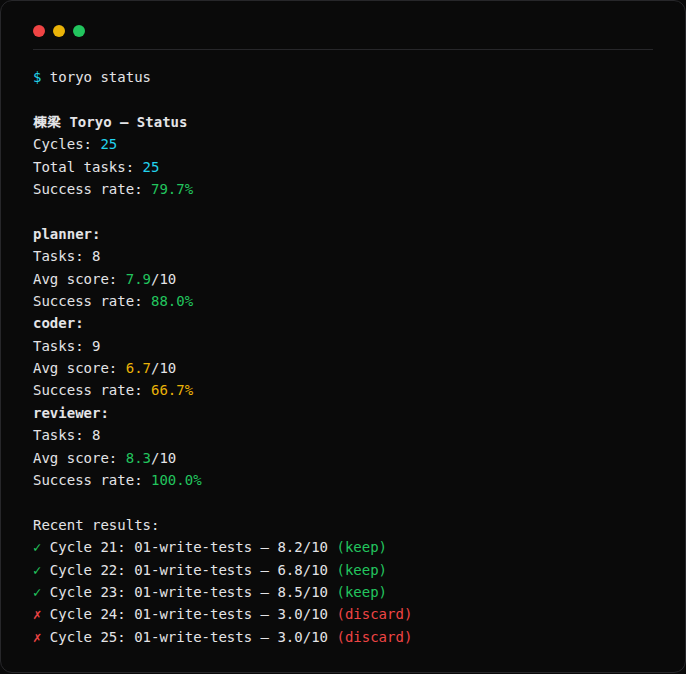

# Getting Started

This guide walks you through installing Toryo, configuring your first agents, writing a task spec, and running your first orchestration cycle.

## Prerequisites

- **Node.js 20+** (Toryo uses modern JS features like `fetch` and top-level `await`)
- **At least one AI coding tool installed:**
  - [Claude Code](https://claude.ai/code) (`claude` CLI)
  - [Aider](https://aider.chat) (`aider` CLI)
  - [Gemini CLI](https://github.com/google-gemini/gemini-cli) (`gemini` CLI)
  - [Codex CLI](https://github.com/openai/codex) (`codex` CLI)
  - [Ollama](https://ollama.ai) (runs locally, no CLI needed -- uses HTTP API directly)
- **Git** (required for quality ratcheting with `commit-revert` or `branch-per-task` strategies)

## Installation

Install globally:

```bash
npm install -g toryo
```

Or run without installing:

```bash
npx toryo
```

If you are working from the monorepo source:

```bash
git clone https://github.com/your-org/toryo.git
cd toryo
npm install
npm run build
```

## Initialize a Project

Run `toryo init` in your project directory:

```bash
cd my-project
npx toryo init
```

This creates two things:

1. **`toryo.config.json`** -- the main configuration file with agent definitions, quality gates, and delegation rules.
2. **`specs/01-write-tests.md`** -- an example task specification.

The generated config starts with three Claude Code agents (researcher, coder, reviewer). You can edit this to use any combination of adapters.

## Configuring Agents

Open `toryo.config.json` and edit the `agents` section. Each agent needs:

| Field | Required | Description |
|-------|----------|-------------|
| `adapter` | Yes | Which tool to use: `claude-code`, `aider`, `gemini-cli`, `codex`, `ollama`, or `custom` |
| `model` | No | Model name passed to the adapter (e.g., `claude-sonnet-4-6`, `qwen3.5:27b`) |
| `strengths` | Yes | Array of keywords describing what the agent is good at. Used for automatic task delegation. |
| `weaknesses` | No | Array of keywords for what the agent struggles with. |
| `timeout` | Yes | Maximum seconds before the agent is killed. |
| `tools` | No | List of available tools/capabilities. |

### Example: Hybrid Setup (Cloud + Local)

```json
{
  "agents": {
    "researcher": {
      "adapter": "claude-code",
      "model": "claude-sonnet-4-6",
      "strengths": ["research", "analysis", "summarization"],
      "timeout": 900
    },
    "coder": {
      "adapter": "ollama",
      "model": "qwen3.5:27b",
      "strengths": ["code", "architecture", "testing"],
      "timeout": 900
    },
    "reviewer": {
      "adapter": "claude-code",
      "model": "claude-sonnet-4-6",
      "strengths": ["review", "scoring", "quality"],
      "timeout": 600
    }
  }
}
```

Toryo uses agent strengths to match tasks to agents automatically. The delegation system looks for keyword overlap between the task profile (derived from the spec text) and each agent's `strengths` array. See [concepts.md](./concepts.md) for details on how delegation works.

## Writing Your First Spec

Create a markdown file in your `specs/` directory:

```markdown
---
name: Write Unit Tests
difficulty: 0.5
tags: [testing]
phases:
  plan: auto
  research: auto
  execute: auto
  review: auto
---

Write comprehensive unit tests for uncovered code in the project.

Focus on:
- Functions with complex logic or branching
- Edge cases and error handling

## Acceptance Criteria
- [ ] Tests cover at least one previously untested module
- [ ] All tests pass when run
- [ ] Edge cases are covered
```

The YAML frontmatter defines metadata. The markdown body is the task description sent to agents. Acceptance criteria are parsed from the `acceptance_criteria` frontmatter field or from markdown checkboxes under an "Acceptance Criteria" heading. See [specs.md](./specs.md) for the full spec format.

## Running Your First Cycle

Start the orchestrator:

```bash
npx toryo run
```

This runs cycles indefinitely, rotating through your specs. To limit to a specific number of cycles:

```bash
npx toryo run --cycles 5
# or shorthand:
npx toryo run -n 5
```

You will see live output showing each phase as it runs:


Use `--config` (or `-c`) to specify a different config file:

```bash
npx toryo run --config ./configs/production.json --cycles 10
```

## Preflight Check

Before running, validate your setup:

```bash
npx toryo check
```

This verifies your config, checks that each agent's CLI tool is installed, lists your task specs, and shows your ratchet/delegation settings. Fix any issues before running.

## Preview with Dry Run

See what would happen without executing:

```bash
npx toryo run --dry-run
```

Shows agents, task rotation order, and phase assignments without calling any AI tools.

## Checking Results

View current metrics and recent results:

```bash
npx toryo status
```

Output:



All results are also logged to `.toryo/results.tsv` in tab-separated format, and metrics are persisted in `.toryo/metrics.json`.

## Starting the Dashboard

For a real-time web view of your orchestration:

```bash
npx toryo dashboard
```

This opens a dashboard at `http://localhost:3100`:


See [dashboard.md](./dashboard.md) for details.

## Next Steps

- [Configuration Reference](./configuration.md) -- every config field documented
- [Task Spec Format](./specs.md) -- advanced spec features
- [Adapters Guide](./adapters.md) -- setting up each adapter
- [Core Concepts](./concepts.md) -- how ratcheting, delegation, and the Ralph Loop work
